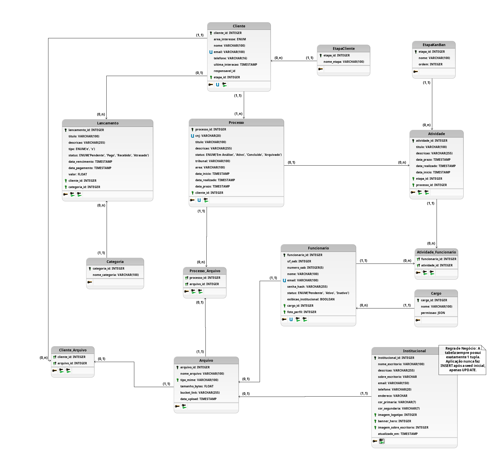

# Banco de Dados

## 1. Diagrama Lógico de Dados (DLD)

O **Diagrama Lógico de Dados (DLD)** é uma representação da estrutura do banco de dados que fica em um nível intermediário entre o Diagrama Entidade-Relacionamento (conceitual) e o Diagrama Físico de Dados (implementação real em um SGBD específico). Diferente do modelo conceitual, o DLD já detalha as tabelas com seus atributos, tipos de dados, chaves primárias (PK), chaves estrangeiras (FK) e as cardinalidades dos relacionamentos entre as entidades — porém ainda sem se prender a particularidades de sintaxe, índices ou otimizações de um Sistema Gerenciador de Banco de Dados (SGBD) específico.

Ou seja, o DLD serve para validar se a estrutura de dados projetada realmente atende às regras de negócio levantadas com o cliente antes de partir para a implementação física (scripts SQL, migrations, engine do banco, etc.). No caso deste projeto, o DLD abaixo modela as entidades de clientes, processos, atividades (Kanban), financeiro, arquivos, equipe (funcionários e cargos) e o conteúdo institucional do escritório.

## 2. Dicionário de Dados

O **dicionário de dados** é um documento complementar ao DLD que descreve, em formato textual e detalhado, cada tabela e cada atributo do banco de dados: seu nome, seu significado (o que representa para o negócio), seu tipo de dado e as restrições aplicadas a ele (chave primária, chave estrangeira, unicidade, obrigatoriedade, etc.). Enquanto o diagrama oferece uma visão gráfica e rápida das entidades e de como elas se relacionam, o dicionário de dados existe para eliminar ambiguidades: ele é a referência oficial consultada pela equipe de desenvolvimento durante a implementação e por qualquer pessoa que precise entender o propósito de uma tabela ou coluna sem precisar interpretar o diagrama.

### 2.1. Cliente

<table>
<tr><th colspan="4">Cliente</th></tr>
<tr><td colspan="4">Entidade que irá guardar os dados dos clientes provenientes do formuário do site institucional ou adicionados manualmente pelos funcionários</td></tr>
<tr><th>Nome do Atributo</th><th>Descrição</th><th>Tipo</th><th>Restrições</th></tr>
<tr><td>cliente_id</td><td>Identificador único e numérico do cliente</td><td>INTEGER</td><td>PK, AUTO-INCREMENT</td></tr>
<tr><td>area_interesse</td><td>Área da advocacia envolvida no caso do cliente.</td><td>ENUM</td><td></td></tr>
<tr><td>nome</td><td>Nome do Cliente</td><td>VARCHAR(100)</td><td>NOT NULL</td></tr>
<tr><td>email</td><td>Email do Cliente</td><td>VARCHAR(100)</td><td>UNIQUE, NOT NULL</td></tr>
<tr><td>telefone</td><td>Telefone do Cliente</td><td>VARCHAR(16)</td><td>NOT NULL</td></tr>
<tr><td>ultima_interacao</td><td>Data da última interação feita por um dos funcionários com o cliente por meio de atividades ou anexação de documentos</td><td>TIMESTAMP</td><td>NOT NULL</td></tr>
<tr><td>responsavel_id</td><td>Chave estrangeira para tabela Funcionario, indica quem é o responsável pelo atendimento e resolução do problema do cliente</td><td>INTEGER</td><td>FK</td></tr>
<tr><td>etapa_id</td><td>Chave estrangeira para tabela EtapaCliente, indica em que fase o cliente está do processo de negócio</td><td>INTEGER</td><td>FK, NOT NULL</td></tr>
</table>

### 2.2. EtapaCliente

<table>
<tr><th colspan="4">EtapaCliente</th></tr>
<tr><td colspan="4">Entidade que irá guardar as etapas de negociação de um cliente</td></tr>
<tr><th>Nome do Atributo</th><th>Descrição</th><th>Tipo</th><th>Restrições</th></tr>
<tr><td>etapa_id</td><td>Identificador único e numérico da etapa</td><td>INTEGER</td><td>PK, AUTO-INCREMENT</td></tr>
<tr><td>nome_etapa</td><td>Nome da etapa</td><td>VARCHAR(100)</td><td>NOT NULL</td></tr>
</table>

### 2.3. EtapaKanban

<table>
<tr><th colspan="4">EtapaKanban</th></tr>
<tr><td colspan="4">Entidade responsável em guardar as etapas possíveis para a renderização de um KanBan</td></tr>
<tr><th>Nome do Atributo</th><th>Descrição</th><th>Tipo</th><th>Restrições</th></tr>
<tr><td>etapa_id</td><td>Identificador único e numérico da etapa do KanBan</td><td>INTEGER</td><td>PK, AUTO-INCREMENT</td></tr>
<tr><td>nome</td><td>Nome da Etapa para o KanBan</td><td>VARCHAR(100)</td><td>NOT NULL</td></tr>
<tr><td>ordem</td><td>A ordem em que a etapa atual estará renderizado no KanBan</td><td>INTEGER</td><td>NOT NULL</td></tr>
</table>

### 2.4. Lancamento

<table>
<tr><th colspan="4">Lancamento</th></tr>
<tr><td colspan="4">Entidade que irá guardar os lançamentos financeiros previstos ou registrados, podendo ser de entrada (lucros) ou saídas (despesas) da advocacia</td></tr>
<tr><th>Nome do Atributo</th><th>Descrição</th><th>Tipo</th><th>Restrições</th></tr>
<tr><td>lancamento_id</td><td>Identificador único e numérico do lançamento</td><td>INTEGER</td><td>PK, AUTO-INCREMENT</td></tr>
<tr><td>titulo</td><td>Título breve do lançamento financeiro</td><td>VARCHAR(100)</td><td>NOT NULL</td></tr>
<tr><td>descricao</td><td>Descrição detalhada do lançamento financeiro</td><td>VARCHAR(255)</td><td>NOT NULL</td></tr>
<tr><td>tipo</td><td>Indica se o lançamento foi/será uma entrada ou uma saída. 'e' indica entrada, 's' indica saída.</td><td>ENUM('e', 's')</td><td>NOT NULL</td></tr>
<tr><td>status</td><td>Indica o estado do lançamento, se está em pendencia (planejado de acontecer), pago ou recebido (o movimento financeiro ocorreu), ou atrasado (a data planejada para o movimento financeiro passou, mas não ocorreu).</td><td>ENUM('Pendente', 'Pago', 'Recebido', 'Atrasado')</td><td>NOT NULL</td></tr>
<tr><td>data_vencimento</td><td>Indica a data limite para que a entrada/saída ocorra</td><td>TIMESTAMP</td><td>NOT NULL</td></tr>
<tr><td>data_pagamento</td><td>Indica a data em que houve o movimento financeiro planejado</td><td>TIMESTAMP</td><td></td></tr>
<tr><td>valor</td><td>Valor monetário envolvido em Real (R$)</td><td>FLOAT</td><td>NOT NULL</td></tr>
<tr><td>cliente_id</td><td>Chave estrangeira para a tabela Cliente. Se aplicável, indica o cliente envolvido neste movimento financeiro</td><td>INTEGER</td><td>FK</td></tr>
<tr><td>categoria_id</td><td>Chave estrangeira para a tabela Categoria, indicando a envolvida neste lançamento financeiro</td><td>INTEGER</td><td>FK, NOT NULL</td></tr>
</table>

### 2.5. Categoria

<table>
<tr><th colspan="4">Categoria</th></tr>
<tr><td colspan="4">Entidade que irá registrar as categorias possíveis para que os lançamentos financeiros especifiquem em que área é o objetivo do movimento financeiro</td></tr>
<tr><th>Nome do Atributo</th><th>Descrição</th><th>Tipo</th><th>Restrições</th></tr>
<tr><td>categoria_id</td><td>Identificado único e numérico da categoria</td><td>INTEGER</td><td>PK, AUTO-INCREMENT</td></tr>
<tr><td>nome_categoria</td><td>Nome da Categoria</td><td>VARCHAR(100)</td><td>NOT NULL</td></tr>
</table>

### 2.6. Processo

<table>
<tr><th colspan="4">Processo</th></tr>
<tr><td colspan="4">Entidade responsável em registrar todos os processos da advocacia</td></tr>
<tr><th>Nome do Atributo</th><th>Descrição</th><th>Tipo</th><th>Restrições</th></tr>
<tr><td>processo_id</td><td>Identificador único e numérico do processo</td><td>INTEGER</td><td>PK, AUTO-INCREMENT</td></tr>
<tr><td>cnj</td><td>Identificado único do número CNJ do processo, que padroniza a identificação de todas as ações judiciais do Brasil</td><td>VARCHAR(20)</td><td>UNIQUE</td></tr>
<tr><td>titulo</td><td>Título breve do processo</td><td>VARCHAR(100)</td><td>NOT NULL</td></tr>
<tr><td>descricao</td><td>Detalhes do processo</td><td>VARCHAR(255)</td><td>NOT NULL</td></tr>
<tr><td>status</td><td>Indica o estado do processo. 'Em análise' indica se foi feito uma solicitação por um cliente e, portando, a advocacia ainda está avaliando se irá prosseguir com o processo. 'Ativo' indica que a advocacia está trabalhando no processo. 'Concluído' indica que o processo teve uma resolução e o 'Arquivado' indica que o processo foi interrompido. </td><td>ENUM('Em Análise', 'Ativo', 'Concluído', 'Arquivado')</td><td>NOT NULL</td></tr>
<tr><td>tribunal</td><td>Tribunal envolvido no processo</td><td>VARCHAR(100)</td><td>NOT NULL</td></tr>
<tr><td>area</td><td>Área da advocacia que se enquadra no processo</td><td>VARCHAR(100)</td><td>NOT NULL</td></tr>
<tr><td>data_inicio</td><td>Data em que o processo foi iniciado</td><td>TIMESTAMP</td><td>NOT NULL</td></tr>
<tr><td>data_realizado</td><td>Data em que o processo teve uma resolução</td><td>TIMESTAMP</td><td></td></tr>
<tr><td>data_prazo</td><td>Data máxima planejada para que o processo seja concluido</td><td>TIMESTAMP</td><td>NOT NULL</td></tr>
<tr><td>cliente_id</td><td>Chave estrangeira para a tabela Cliente, indica qual o cliente está envolvido no processo</td><td>INTEGER</td><td>FK, NOT NULL</td></tr>
</table>

### 2.7. Atividade

<table>
<tr><th colspan="4">Atividade</th></tr>
<tr><td colspan="4">Entidade responsável em registrar as atividades da advocacia, possibilitando a delegação das responsabilidades</td></tr>
<tr><th>Nome do Atributo</th><th>Descrição</th><th>Tipo</th><th>Restrições</th></tr>
<tr><td>atividade_id</td><td>Identificador único e numérico da atividade</td><td>INTEGER</td><td>PK, AUTO-INCREMENT</td></tr>
<tr><td>titulo</td><td>Titulo breve da atividade</td><td>VARCHAR(100)</td><td>NOT NULL</td></tr>
<tr><td>descricao</td><td>Descrição detalhada do processo</td><td>VARCHAR(255)</td><td>NOT NULL</td></tr>
<tr><td>data_prazo</td><td>Data máxima planejada para a conclusão da atividade</td><td>TIMESTAMP</td><td>NOT NULL</td></tr>
<tr><td>data_realizado</td><td>Data em que a atividade foi efetivamente concluída</td><td>TIMESTAMP</td><td></td></tr>
<tr><td>data_inicio</td><td>Data em que a atividade foi iniciada</td><td>TIMESTAMP</td><td>NOT NULL</td></tr>
<tr><td>etapa_id</td><td>Chave estrangeira para a tabela EtapaKanBan, indicando em que etapa a atividade está</td><td>INTEGER</td><td>FK, NOT NULL</td></tr>
<tr><td>processo_id</td><td>Chave estrangeira para a tabela Processo. Se aplicável, indica qual o processo em que a atividade está relacionada</td><td>INTEGER</td><td>FK</td></tr>
</table>

### 2.8. Atividade_Funcionario

<table>
<tr><th colspan="4">Atividade_Funcionario</th></tr>
<tr><td colspan="4">Tabela de Relacionamento, permite a cardinalidade (n, n) entre a tabela Atividade e Funcionário</td></tr>
<tr><th>Nome do Atributo</th><th>Descrição</th><th>Tipo</th><th>Restrições</th></tr>
<tr><td>funcionario_id</td><td>Chave estrangeira para a tabela Funcionario, indicando o funcionário responsável pela atividade</td><td>INTEGER</td><td>PK, FK, NOT NULL</td></tr>
<tr><td>atividade_id</td><td>Chave estrangeira para a tabela Atividade, indicando a atividade envolvida</td><td>INTEGER</td><td>PK, FK, NOT NULL</td></tr>
</table>

### 2.9. Processo_Arquivo

<table>
<tr><th colspan="4">Processo_Arquivo</th></tr>
<tr><td colspan="4">Tabela de Relacionamento, permite a cardinalidade (n, n) entre a tabela Processo e Arquivo</td></tr>
<tr><th>Nome do Atributo</th><th>Descrição</th><th>Tipo</th><th>Restrições</th></tr>
<tr><td>processo_id</td><td>Chave estrangeira para a tabela Processo, indicando qual o processo envolvido</td><td>INTEGER</td><td>PK, FK, NOT NULL</td></tr>
<tr><td>arquivo_id</td><td>Chave estrangeira para a tabela Arquivo, apontando para o anexo de um arquivo ao processo especificado</td><td>INTEGER</td><td>PK, FK, NOT NULL</td></tr>
</table>

### 2.10. Cliente_Arquivo

<table>
<tr><th colspan="4">Cliente_Arquivo</th></tr>
<tr><td colspan="4">Tabela de Relacionamento, permite a cardinalidade (n, n) entre a tabela Cliente e Arquivo</td></tr>
<tr><th>Nome do Atributo</th><th>Descrição</th><th>Tipo</th><th>Restrições</th></tr>
<tr><td>cliente_id</td><td>Chave estrangeira para a tabela Cliente, indicando o cliente envolvido</td><td>INTEGER</td><td>PK, FK</td></tr>
<tr><td>arquivo_id</td><td>Chave estrangeira para a tabela Arquivo, apontando para o anexo de um arquivo ao cliente especificado</td><td>INTEGER</td><td>PK, FK</td></tr>
</table>

### 2.11. Arquivo

<table>
<tr><th colspan="4">Arquivo</th></tr>
<tr><td colspan="4">Entidade responsável por registrar o caminho de arquivos (PDF, CSV ou Excel). Outra plataforma de Buckets irá salvar os arquivos puros, deixando para a tabela Arquivo somente auxiliar à apontar o caminho aos arquivos salvos externamente</td></tr>
<tr><th>Nome do Atributo</th><th>Descrição</th><th>Tipo</th><th>Restrições</th></tr>
<tr><td>arquivo_id</td><td>Identificador único e numérico do Arquivo</td><td>INTEGER</td><td>PK, AUTO-INCREMENT</td></tr>
<tr><td>nome_arquivo</td><td>Nome breve do arquivo</td><td>VARCHAR(100)</td><td>NOT NULL</td></tr>
<tr><td>tipo_mime</td><td>Indica se o arquivo é PDF, CSV ou EXCEL</td><td>VARCHAR(100)</td><td>NOT NULL</td></tr>
<tr><td>tamanho_bytes</td><td>Tamanho em Bytes do arquivo salvo</td><td>FLOAT</td><td>NOT NULL</td></tr>
<tr><td>bucket_link</td><td>Link que aponta para o arquivo puro, salvo externamento em um bucket</td><td>VARCHAR(255)</td><td>NOT NULL</td></tr>
<tr><td>data_upload</td><td>Data em que o arquivo foi salvo</td><td>TIMESTAMP</td><td>NOT NULL</td></tr>
</table>

### 2.12. Funcionario

<table>
<tr><th colspan="4">Funcionario</th></tr>
<tr><td colspan="4">Entidade responsável por guardar todos os funcionários ativos na advocacia</td></tr>
<tr><th>Nome do Atributo</th><th>Descrição</th><th>Tipo</th><th>Restrições</th></tr>
<tr><td>funcionario_id</td><td>Identificador único e numérico do funcionário</td><td>INTEGER</td><td>PK</td></tr>
<tr><td>uf_oab</td><td>Código numérico da Unidade Federativa (UF) em que o funcionário é inscrito na OAB</td><td>INTEGER</td><td></td></tr>
<tr><td>numero_oab</td><td>Número de inscrição do funcionário na OAB (Ordem dos Advogados do Brasil)</td><td>INTEGER(5)</td><td></td></tr>
<tr><td>nome</td><td>Nome do funcionário</td><td>VARCHAR(100)</td><td>NOT NULL</td></tr>
<tr><td>email</td><td>Email do funcionário, utilizado também como login de acesso à área administrativa</td><td>VARCHAR(100)</td><td>UNIQUE, NOT NULL</td></tr>
<tr><td>senha_hash</td><td>Hash da senha do funcionário, utilizada para autenticação na área administrativa</td><td>VARCHAR(255)</td><td></td></tr>
<tr><td>status</td><td>Indica se o funcionário está aguardando realizar o primeiro acesso (Pendente), se está com acesso à área admnistrativa (Ativo), ou se está sem permissão de acesso à área adminstrativa ('Inativo')</td><td>ENUM('Pendente', 'Ativo', 'Inativo')</td><td>NOT NULL</td></tr>
<tr><td>exibicao_institucional</td><td>Indica se o funcioário irá aparecer na tela da página institucional, na aba de funcionários</td><td>BOOLEAN</td><td>NOT NULL</td></tr>
<tr><td>cargo_id</td><td>Chave estrangeira para a tabela Cargo, indicando o cargo do funcionário e, consequentemente, seu nível de permissão de acesso à área administrativa</td><td>INTEGER</td><td>FK, NOT NULL</td></tr>
<tr><td>foto_perfil</td><td>Chave estrangeira para a tabela Arquivo, que irá guardar o link do bucket da foto de perfil do usuário (sempre em PNG ou JPG)</td><td>INTEGER</td><td>FK, NOT NULL</td></tr>
</table>

### 2.13. Cargo

<table>
<tr><th colspan="4">Cargo</th></tr>
<tr><td colspan="4">Entidade respnosável por guardar os cargos que terão diferentes níveis de acesso à plataforma</td></tr>
<tr><th>Nome do Atributo</th><th>Descrição</th><th>Tipo</th><th>Restrições</th></tr>
<tr><td>cargo_id</td><td>Identificador único e numérico do cargo</td><td>INTEGER</td><td>PK, AUTO-INCREMENT</td></tr>
<tr><td>nome</td><td>Nome do cargo</td><td>VARCHAR(100)</td><td>NOT NULL</td></tr>
<tr><td>permissao</td><td>Lista de permissões que o cargo possuirá ou não dentro da área administrativa</td><td>JSON</td><td>NOT NULL</td></tr>
</table>

### 2.14. Institucional

<table>
<tr><th colspan="4">Institucional</th></tr>
<tr><td colspan="4">Entidade <b>SINGLETON</b> responsável por guardar dados de personalização da página institucional, isto é, só existirá 1 registro na tabela. Novas mudanças na tabela deverão ser feitas via UPDATE e jamais INSERT.</td></tr>
<tr><th>Nome do Atributo</th><th>Descrição</th><th>Tipo</th><th>Restrições</th></tr>
<tr><td>institucional_id</td><td>Identificador único e numérico da personalização da institucional</td><td>INTEGER</td><td>PK</td></tr>
<tr><td>nome_escritorio</td><td>Nome do escritório de advocacia, exibido na página institucional</td><td>VARCHAR(100)</td><td>NOT NULL</td></tr>
<tr><td>descricao</td><td>Descrição breve do escritório, exibida na página institucional</td><td>VARCHAR(255)</td><td>NOT NULL</td></tr>
<tr><td>sobre_escritorio</td><td>Texto detalhado sobre a história, missão ou valores do escritório, exibido na seção "Sobre" da página institucional</td><td>VARCHAR</td><td>NOT NULL</td></tr>
<tr><td>email</td><td>Email de contato do escritório, exibido na página institucional</td><td>VARCHAR(150)</td><td>NOT NULL</td></tr>
<tr><td>telefone</td><td>Telefone de contato do escritório, exibido na página institucional</td><td>VARCHAR(20)</td><td>NOT NULL</td></tr>
<tr><td>endereco</td><td>Endereço físico do escritório, exibido na página institucional</td><td>VARCHAR</td><td>NOT NULL</td></tr>
<tr><td>cor_primaria</td><td>Cor primária (em hexadecimal) utilizada na identidade visual da página institucional</td><td>VARCHAR(7)</td><td>NOT NULL</td></tr>
<tr><td>cor_segundaria</td><td>Cor secundária (em hexadecimal) utilizada na identidade visual da página institucional</td><td>VARCHAR(7)</td><td>NOT NULL</td></tr>
<tr><td>imagem_logotipo</td><td>Chave estrangeira para a tabela Arquivo, apontando para a imagem do logotipo do escritório exibida na página institucional</td><td>INTEGER</td><td>FK, NOT NULL</td></tr>
<tr><td>banner_hero</td><td>Chave estrangeira para a tabela Arquivo, apontando para a imagem de destaque (banner) exibida na seção inicial (hero) da página institucional</td><td>INTEGER</td><td>FK, NOT NULL</td></tr>
<tr><td>imagem_sobre_escritorio</td><td>Chave estrangeira para a tabela Arquivo, apontando para a imagem exibida na seção "Sobre" da página institucional</td><td>INTEGER</td><td>FK, NOT NULL</td></tr>
<tr><td>atualizado_em</td><td>Data da última atualização destes dados de personalização</td><td>TIMESTAMP</td><td>NOT NULL</td></tr>
</table>

 
 
 

---
## Histórico de Versão da Página

::timeline::

- title: v1.0
  sub_title: 14/09/2026
  content: Criação do documento, inserção do Diagrama Lógico de Dados e estrutura do dicionário de dados por tabela, por [Daniel Rodrigues](https://github.com/DanielRogs).
  icon: ':material-file-document-plus-outline:'

::/timeline::
