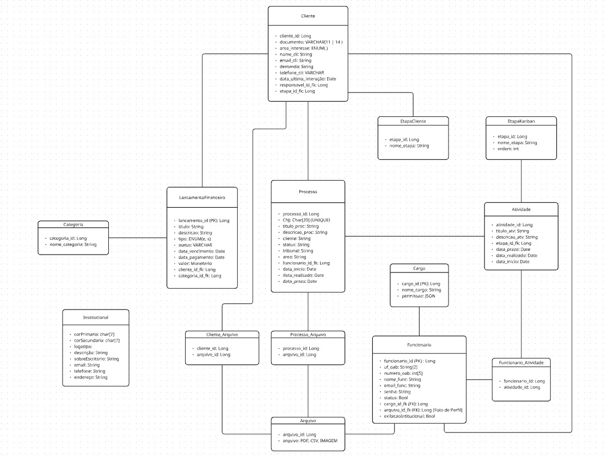

# Sprint 1

## 1. Detalhes da Reunião
| Tipo Informação            | Descrição                                                                                                     |
| -------------------------- | ------------------------------------------------------------------------------------------------------------- |
| Data da Reunião            | 02/09/2026                                                                                                    |
| Horário da Reunião         | 20:34                                                                                                         |
| Modalidade                 | Vídeo Conferência (Online)                                                                                    |
| Participantes Envolvidos   | Desenvolvedores                                                                                               |
| Membros Presentes          | Arthur Evangelista, Daniel Rodrigues, Davi Camilo, Davi Rodrigues, Pedro Miguel e Tiago Antunes               |

## 2. Resumo da Reunião
#### 2.1. Objetivo da Reunião

Realizar a modelagem do banco de dados do projeto requisito por requisito, definindo a estrutura lógica das tabelas de funcionários, financeiro, Kanban/atividades, processos, clientes e perfil institucional, a fim de consolidar um diagrama de dados alinhado às necessidades do escritório.

#### 2.2. Pautas da Reunião
| Pauta                                                     |
| --------------------------------------------------------- |
| Desenvolvimento do Diagrama Lógico de Dados do Projeto    |

#### 2.3. Decisões Importantes

- O PostgreSQL foi definido como banco de dados do projeto, em ambiente local e containerizado, descartando bancos não relacionais e o Supabase por complexidade desnecessária ao escopo do MVP.
- A entidade principal de atores do sistema foi nomeada "Funcionário" (em vez de "Usuário"), para diferenciá-la dos visitantes/clientes da página pública; a tabela incluirá um atributo de status (ativo/inativo) que permite revogar ou conceder acesso sem excluir o registro.
- O controle de acesso será baseado em "Cargo" (substituindo "Perfil"), com permissões armazenadas como uma lista de strings (flags) dentro da própria tabela de cargos, focando em papéis como administrador, advogado e estagiário, em vez de personalizações individuais por usuário.
- A estrutura financeira foi unificada em uma única tabela "Lançamento Financeiro", contendo título, descrição, tipo (entrada/saída), status (pendente/concluído/cancelado), valor, categoria, data de vencimento e data de pagamento; os campos de pagante e recebedor passarão a ser relacionamentos diretos com as tabelas de clientes e funcionários, em vez de texto livre.
- As colunas do quadro Kanban serão dinâmicas (não fixas), permitindo que o usuário crie e gerencie suas próprias etapas; o termo "status" foi substituído por "etapa", armazenando nome e ordem de exibição das colunas.
- O indicador de produtividade da equipe será calculado com base apenas nas atividades concluídas pelos colaboradores.
- Na tabela de processos, o número do CNJ será tratado como atributo opcional (armazenado como string) e não como chave primária, já que casos extrajudiciais não possuem esse número; o registro usará um identificador interno.
- A funcionalidade de anexar arquivos ficará vinculada ao processo, e não à atividade individual, para evitar complexidade excessiva.
- O cálculo de contraste de cores para a fonte será delegado ao frontend, não sendo necessário armazenar essa configuração no banco de dados.
- A tabela de clientes utilizará status de "lead" (novas solicitações) e "consolidado" (clientes efetivados); a gestão de clientes por etapas de negociação (CRM) será feita reaproveitando a tabela de clientes existente, sem criação de uma tabela separada, e sem sistema de comentários ou integrações complexas no MVP.
- A data da última interação com o cliente será calculada automaticamente pelo sistema, com base na última mudança ocorrida no processo, em vez de depender de inserção manual.
- O perfil do funcionário no site institucional exibirá foto, nome, cargo, área de atuação e número da OAB; a exibição de funcionários no site será gerenciada por uma lista com checkboxes de seleção, em vez de entrada manual.
- Requisitos que envolvem exportação de relatórios usarão um campo de URL nas tabelas pertinentes para armazenar links de documentos externos, evitando modelar um sistema de arquivos no banco neste momento.
- Ponto em aberto: identificada a necessidade de uma solução externa de armazenamento de arquivos (imagens e documentos), além do banco de dados — ainda é preciso pesquisar plataformas adequadas (ex.: Cloudflare R2) e consultar o cliente sobre a volumetria atual antes de decidir.

##### Diagrama Lógico de Dados Conceito

##### 2.3.1 Próximos passos

- Pesquisar plataformas de armazenamento de arquivos externas ao PostgreSQL para lidar com documentos e imagens, compartilhando as opções encontradas no grupo do WhatsApp até sexta-feira.
- Consultar o cliente sobre o volume total de documentos e imagens armazenados atualmente e o gasto mensal de memória, para planejar a capacidade de armazenamento necessária.
- Enviar o protótipo ao cliente após a conclusão dos ajustes necessários.
- Atualizar o protótipo para incluir a estrutura de processos e possibilitar a gestão de colunas do Kanban, distinguindo claramente o quadro de atividades do quadro de processos.
- Validar com o cliente a regra de associação entre atividades e processos.
- Compartilhar o diagrama atualizado do banco de dados com a equipe, incluindo o refinamento dos tipos de dados genéricos e a integração correta das entidades de usuários.

## 3. Atividades
<!--
  O código das atividades deverão estar no seguinte formato: 
    AT <Número da Atividade em Ordem Crescente com 2 dígitos> S <Numero da Sprint com 2 Dígitos>
  Por exemplo:
    AT01S02
  Isso indica que é uma atividade de código 01 da Sprint 02
-->
#### 3.1. Atividades Novas
<!-- | Código | Título                              | Link da Issue                              | Responsável(is)                            |
| ------ | ----------------------------------- | ------------------------------------------ | ------------------------------------------ | -->
_Sem atividade nova_

 

#### 3.2. Atividades Finalizadas
<!-- | Código | Título                              | Link da Issue                              | Responsável(is)                            |
| ------ | ----------------------------------- | ------------------------------------------ | ------------------------------------------ | -->
_Sem atividade finalizada_

 

#### 3.3. Atividades em Débito
<!-- | Código | Título                              | Link da Issue                              | Responsável(is)                            |
| ------ | ----------------------------------- | ------------------------------------------ | ------------------------------------------ | -->
_Sem atividade em débito_

## 4. Gravação da Reunião

<iframe width="100%" height="450" src="https://www.youtube.com/embed/Qwy7XAttCV8?si=NWgzElHTbQorawkU" title="YouTube video player" frameborder="0" allow="accelerometer; autoplay; clipboard-write; encrypted-media; gyroscope; picture-in-picture; web-share" referrerpolicy="strict-origin-when-cross-origin" allowfullscreen></iframe>

 
 
 

---
## Histórico de Versão da Página

::timeline::

- title: v1.0
  sub_title: 12/09/2026
  content: Criação do documento por [Daniel Rodrigues](https://github.com/DanielRogs).
  icon: ':material-file-document-plus-outline:'

::/timeline::